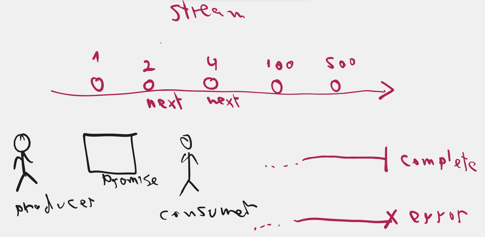
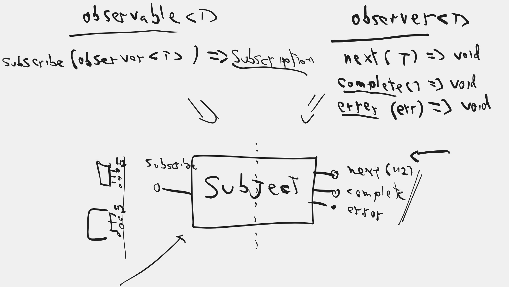
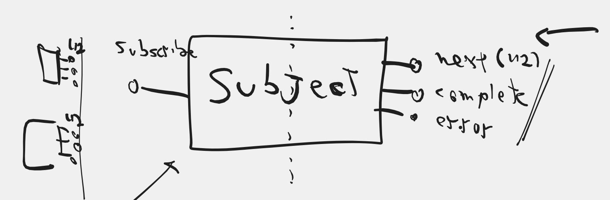
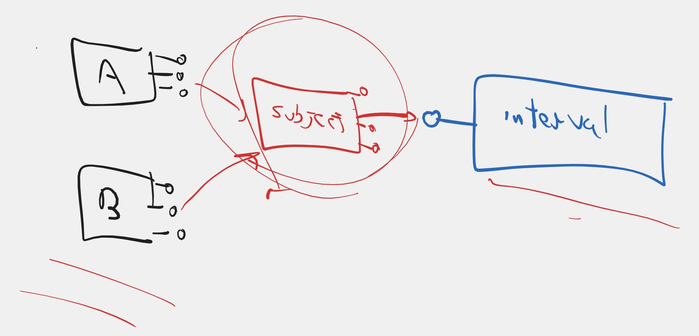
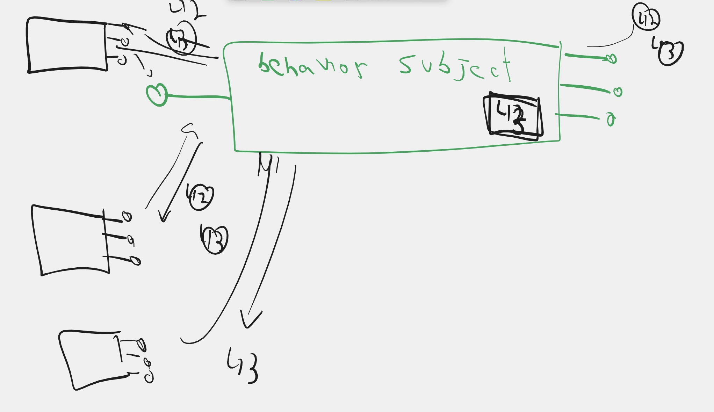

# Module 05 - DI Contd, Signal store, and async programming

## Projects
|     |     |
| --- | --- |
| [DI](./projects//fun-with-di/) | Dependency Injection in Angular 14+ |
| [Signal Store](./projects/fun-with-ngrx-signals/) | Introduction to Signal Store |


## Summary

### Dependency Injection - Continuted
#### Recap
- We talked about the new `inject` function as an alternative, more recommended way, to inject dependencies
- We understood that it can only be used when in **Injection context** meaning:
    - During consrtuctor, or initialization of an angular managed object (Components, Directives, Pipes, Injectables)
    - Inside functions that are executed using `runInInjectionContext` with a proper injector
    - Injection context basically means that it runs in the context of a specific Injector.
#### `DestroyRef`
- Every injector can automatically provide its `DestroyRef`
- The `DestroyRef` is an object that can notify you when the injector is being destroyed so you can do cleanup work
- Every injector has its own `DestroyRef`
- We saw that this is a good alternative to using the `OnDestroy` lifecycle hooks

#### Injection Tokens
- In angular, not just services can be injected
    - You can inject parent component into its children
    - You can inject directives placed on the same host, or higher in the hierarchy into the component
    - You can inject `DestroyRef`
    - You can inject the `Injector` itself
- In angular, also constants, configuration values and even functions  are injectable
    - The problem is that you can not use `string`, `number` and `() => void` as injection token
- You can use the class `InjectionToken<T>` to define a custom injection token

```typescript
const MY_VALUE = new InjectionToken<string>('MY_VALUE');
```

- You can set the value using a provider

```typescript
providers: [
    {provide: MY_VALUE, useValue: 'Hello World'}
]
```

- You could inject it using the `@Inject` decorator.
- But now - better way - you can inject it using the `inject` function

```typescript
class MyComponent {
    readonly myValue = inject(MY_VALIUE);
}
```

- Typescript can infer the type of the value from the generic type of the injection context

#### Injection into functions
- One of the benefits of the `inject` function is that it allows us to write functions that use **Depenency Injection**
- You can write utility functions that take care of their own dependency injection
- For example, we saw a function that starts an interval and runs a lambda every second
    - The function needs the injection context (specifically the `DestroyRef` in order to know when to stop)
    - It Uses the `inject` function to fetch the destroy ref and register cleanup logic
- We saw that in order to allow the function to be optionally ran outside injection context, it can optionally receive the destroy ref in the parameters.
- We saw how to define the parameters so that the function can either be called in injection context, or explicitly receive the dependency:

```typescript
function everySecond(destroyRef: DestroyRef = inject(DestroyRef)) {
    // logic that uses destroyRef
}
```


### NgRx Signal store - Getting Started
#### Overview
- Signal store is a library that allows us to create injectable services that manage state using signals
- The state is stored as one big signal, along with specific signals for each property and sub property
- The signal store architecture is based on functional programming concepts

#### Installation
- We rely on the `ngrx/signals` package which we install using npm
- We then define a `store` folder for each signal store we want to use
- We use the `signalStore` function to create a new signal store

#### Features
- Each signal store is built using "features" that fill it with data and logic
- Each feature is a method that uses the total sum of previous features and add more functionality to the store
- The `withState` feature adds state signals
- The `withComputed` feature adds computed signals
- The `withMethods` feature adds methods 
- The `withHooks` feature adds init and destroy lifecycle hooks

#### Reading and modifying the state
- Use `getState` to get the entire state as one big signal
- Alternatively, for each property of the state, there is a dedicated property returning a signal of that specific slice of the state
- Use `patchState` to modify the state of the entire store
    - `patchState` has to receive the store as first parameter
    - The rest of the parameters are **updaters**
    - Updater is either an object that is a pratial of the state, or a function that takes the previous state and returns a partial of the state
    - In algebric notation, updater is:

```typesript
type Updater<Slice> = Partial<Slice> 
                        | (s: Slice) => Partial<Slice>
```

So, assuming the state is of shape: {x: number, y: number}
these are all valid calls to `patchState`:

```typescript
patchState(store, {x: 10});
patchState(store, state => {x: state.x + 1});
patchState(store, {x: 5, y: 5});
patchState(store, {x: 5}, state => {y: state.y + 1})
```

#### Providing the store
You can provide the store in any providers array, either in the `app.config` file or in any component. Just like you would any service.

Additionaly, you can set the store to be provided in the root injector using the configuration:

```typescript
const MyStore = signalStore(
    {providedIn: 'root'}, 
    withState(initialState)
)
```

### Advanced Signal Store
#### Signal Store and injection context
As you have seen, all the "feature" functions (`withComputed`, `withMethods`, `withHooks`) receive a function that creates a collection of key value pairs. 

>**These functions are all executed in injection context**

That means that you can use the `inject` function inside these functions.

in `withComputed`: 
```typescript
const MyStore = signalStore(
    withState(initialState), 
    withComputed(store => {
        const service = inject(ServiceWithSignals);
        return {
            mix: computed(() => store.myData() + service.hisData())
        }
    })
)
```

in `withMethods`: 
```typescript
const MyStore = signalStore(
    withState(initialState), 
    withMethods(store => {
        const service = inject(ServiceWithSignals);
        return {
            callOtherService: (val: number) => {
                const res = service.saveValue(val);
                patchState(store, {result: res});
            }
        }
    })
)
```


#### Using Hooks
One of the interesting possibilities in signal store is to plant initialization and cleanup logics using the `withHooks` feature.

```typescript
    const MyStore = signalStore(
        withState(initialState), 
        withHooks(store => ({
            onInit: () => {
                // init logic
            }
            onDestroy: () => {
                // cleanup logic
            }
        }))
    )
```

- The Hooks method is called in injection context, so you can use `inject`.
- Note that the hooks method is a **function**. So if you want to share variables between the init and the destroy hooks, you can define the variable in the function scope:

```typescript
    const MyStore = signalStore(
        withState(initialState), 
        withHooks(store => {
            const service = inject(MyService);
            let i!: number;
            return {
                onInit: () => {
                    // init logic
                    i = service.initSomething();
                }
                onDestroy: () => {
                    // cleanup logic
                    service.cleanSomething(i);
                }
            }
        })
    )
```

### Reactive X
#### Introduction to Reactive Programming
* We understood the meaning of a `Stream`

* We defined what an `Observer<T>` is and understood that it has 3 methods
    * `next(T)`
    * `complete()`
    * `error(err)`
* We understood that `Observable<T>` is an object that allows observers to subscribe
    * `subscribe(Observer<T>)`

* We saw how to define an observer explicitly by supplying the 3 methods and their implementation
* We saw how to create an observable using the `interval` operator
* We saw that 2 observers that subscribe on different times, get different sets of events that are not synchronized
* We understoof the difference between **cold** observables and **hot** observables
* We have seen a few other factory operators:
  * `timer` - creates an observable with time delay. It has two variations
    * `timer(----)`=>  ----0|
    * `timer(----, --)` => ----0--1--2--3--4...
  * `of` - wraps a value or values inside a synchronous observable
    * `of(42)` => (42)|
    * `of(1, 2, 3)` => 123|
  * `from` - serves as a multifunction converter between any wrapper to observable
    * `from([1, 2, 3])` => [1, 2, 3]|
    * `from(Promise ----42|)` => ----42|
* We saw how to create a custom observable using the observable constructor
* We got familiar with the `Subject` object and understood that it is a hot observable

* We saw that a subject can be used as a proxy to "heat" a cold observable

* We learned about `BehaviorSubject` and understood that it is just a subject that sends the latest event to a new observer on the moment of subscription



